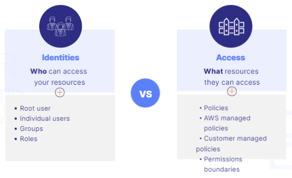
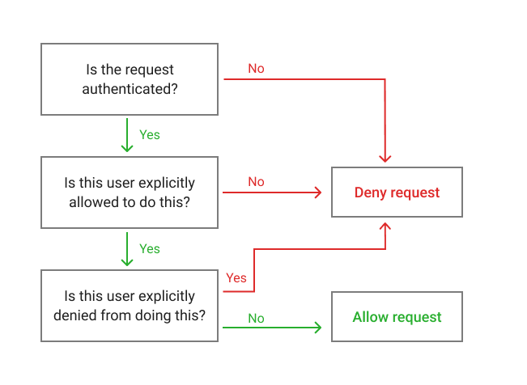

## INDEX

- [INDEX](#index)
- [Cloud Computing](#cloud-computing)
  - [Benefits of the Cloud](#benefits-of-the-cloud)
  - [Types of Cloud Computing](#types-of-cloud-computing)
  - [Cloud Deployment Models](#cloud-deployment-models)
  - [AWS Global Infrastructure](#aws-global-infrastructure)
- [IAM](#iam)
  - [Identities vs Access](#identities-vs-access)
  - [Authentication ("Who") vs Authorization ("What")](#authentication-who-vs-authorization-what)
  - [Groups](#groups)
  - [Roles](#roles)
  - [IAM Policies and Statements](#iam-policies-and-statements)
- [S3](#s3)
  - [S3 Storage Classes](#s3-storage-classes)
  - [Versioning](#versioning)
  - [Transfer Acceleration](#transfer-acceleration)
- [!s3 transfer acceleration](#)
- [Glossary](#glossary)

---

## Cloud Computing

Cloud computing is the delivery of computing services over the
internet.

### Benefits of the Cloud

- Trade capital expense for variable expense
- Benefit from massive economies of scale
- Stop Guessing capacity (Scale up or down at will)
- Increase speed and agility
- Stop spending money on running and maintaining data centers
- Go global in minutes

### Types of Cloud Computing

| Infrastructure as a Service (IaaS)              | Platform as a Service (Paas)                   | Software as a Service (Saas                  |
| ----------------------------------------------- | ---------------------------------------------- | -------------------------------------------- |
| Low Level (computers, networking, storage)      | Remove management of underlying `hardware`     | Capabilities and Hardware are abstracted     |
| Flexible                                        | Macroscopic planning                           |
| End User Software                               | What? instead of How?                          | ex : Email services / marketing              |
| Users: Traditional IT, Government, Universities | Users: Individuals, developers, small startups | Users: Non-technical Users, Office, Students |
| EC2                                             | GoDaddy                                        | Gmail                                        |

---

### Cloud Deployment Models

- Private Cloud
- Public Cloud
- Hybrid Cloud

---

### AWS Global Infrastructure

- Region

  - geographical area. Each region consists of 2 more availability zones connected to each other through links.
  - Fully Independent and Isolated

- Availability zone

  - An availability zone can be a several data centers, but if they are close together, they are counted as 1 availability zone.
  - Allows for high Availability

- Edge Locations
  - Edge locations cache content for fast delivery to your users.
  - Edge locations consist of CloudFront, Amazon's Content Delivery Network (CDN).

---

## IAM

- `IAM` is an AWS service for managing both authentication and authorization in determining who can access which resources in your AWS account.
- `IAM` allows you to control access to your AWS services and resources.
- Root User : has full adminstrator access & permission
- `principle of least privilege` : giving a user the **minimum** access required to get the job done.

---

### Identities vs Access

### Authentication ("Who") vs Authorization ("What")

---

### Groups

- A group is a collection of IAM users that helps you apply common access controls to all group members.

- Groups save you time by allowing you to apply the same access permissions to more than one user at once. When a user no longer needs access, they can be removed from the group.

> Do not confuse security groups for EC2 with IAM groups. EC2 security groups act as firewalls, while IAM groups are collections of users.

---

### Roles

Roles define access permissions and are temporarily assumed by an IAM user or service.

- You can attach a role to an instance that provides privileges (e.g., uploading files to S3) to applications running on the instance.
  
- Roles help you avoid sharing long-term credentials like access keys and protect your instances from unauthorized access.

---

### IAM Policies and Statements

You manage permissions for IAM users, groups, and roles by creating a policy document in `JSON` format and attaching it.

- There are three critical elements to an IAM statement. They are:
  - `Action` -- ex : `s3:GetObject: For reading an object on S3;`
  - `Resource` -- ex : `arn:aws:s3:::my_bucket`
  - `Effect` -- ex : `allow/deny` 

---

## S3

Simple Storage Service

- S3 is an `object storage service` for the cloud that is highly available.
- any thing you upload to s3 `isn't public`, so you have to manually make it so if you want

### S3 Storage Classes

### Versioning

Versioning helps you prevent accidentally overwriting or deleting a file. In a versioning enabled bucket if the
same object key is written multiple times, all of the writes will be recorded with the same object key but
having different version IDs.

### Transfer Acceleration

---

## Glossary

- `Latency` : the time that passes between a user request and the resulting response.

- `Latency` :

- `Latency` :

- `Latency` :

- `Latency` :

- `Latency` :

- `Latency` :
