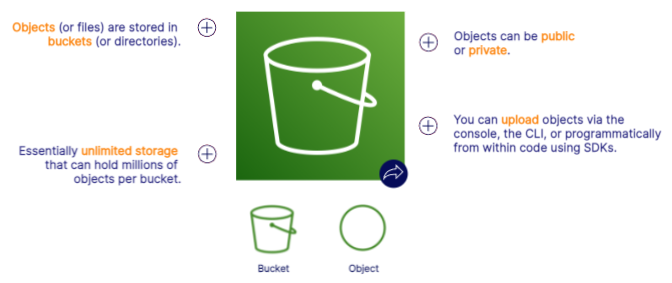
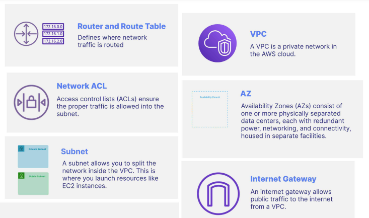
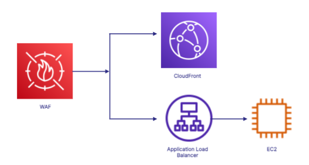
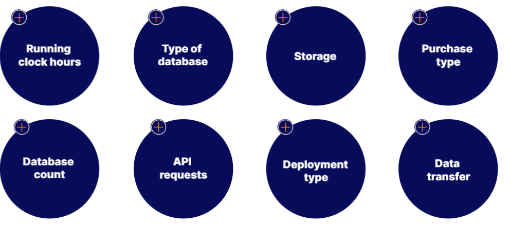
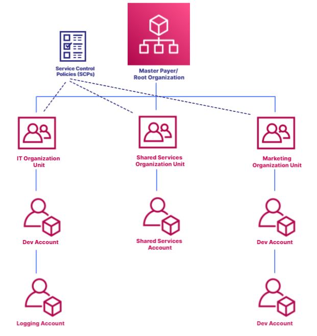

## INDEX

- [INDEX](#index)
- [Source](#source)
- [Cloud Computing](#cloud-computing)
  - [Benefits of the Cloud](#benefits-of-the-cloud)
  - [Types of Cloud Computing](#types-of-cloud-computing)
  - [Cloud Deployment Models](#cloud-deployment-models)
  - [AWS Global Infrastructure](#aws-global-infrastructure)
- [IAM](#iam)
  - [Identities vs Access](#identities-vs-access)
  - [Authentication ("Who") vs Authorization ("What")](#authentication-who-vs-authorization-what)
  - [Groups](#groups)
  - [Roles](#roles)
  - [IAM Policies and Statements](#iam-policies-and-statements)
  - [Shared Responsibility Model](#shared-responsibility-model)
- [Well-Architected Framework](#well-architected-framework)
- [S3](#s3)
  - [S3 Storage Classes](#s3-storage-classes)
  - [Versioning](#versioning)
- [Content Delivery Services](#content-delivery-services)
  - [content delivery network (CDN)](#content-delivery-network-cdn)
  - [Transfer Acceleration](#transfer-acceleration)
  - [CloudFront](#cloudfront)
- [Elastic Compute Cloud (EC2)](#elastic-compute-cloud-ec2)
  - [EC2 Pricing Options](#ec2-pricing-options)
  - [Using The Command Line](#using-the-command-line)
  - [load balancing](#load-balancing)
  - [Auto Scaling](#auto-scaling)
  - [AWS Fargate](#aws-fargate)
- [AWS Lambda](#aws-lambda)
  - [Features](#features)
- [Networking Services: VPC and Subcomponents](#networking-services-vpc-and-subcomponents)
  - [Virtual Private Cloud (VPC)](#virtual-private-cloud-vpc)
  - [Route 53](#route-53)
- [Sequrity](#sequrity)
  - [Web Application Firewall (WAF)](#web-application-firewall-waf)
  - [Distributed Denial of Service (DDoS)](#distributed-denial-of-service-ddos)
  - [Macie](#macie)
  - [Config](#config)
  - [Data encryption](#data-encryption)
    - [Key Management Service (KMS)](#key-management-service-kms)
- [Databases](#databases)
  - [types of databases](#types-of-databases)
  - [OLAP vs OLTP](#olap-vs-oltp)
- [Deployment and Infrastructure Management Services](#deployment-and-infrastructure-management-services)
  - [Infrastructure as Code (IaC)](#infrastructure-as-code-iac)
  - [CloudFormation](#cloudformation)
  - [Elastic Beanstalk](#elastic-beanstalk)
- [Pricing](#pricing)
    - [EC2 Pricing](#ec2-pricing)
    - [Lambda Pricing](#lambda-pricing)
    - [S3 Pricing](#s3-pricing)
    - [RDS Pricing](#rds-pricing)
  - [Total Cost of Ownership (TCO)](#total-cost-of-ownership-tco)
  - [Application Discovery Service](#application-discovery-service)
- [Billing](#billing)
  - [Budget Types](#budget-types)
  - [AWS Budgets](#aws-budgets)
  - [Cost and Usage Report](#cost-and-usage-report)
  - [Cost allocation tags](#cost-allocation-tags)
  - [AWS Cost and Usage Reports](#aws-cost-and-usage-reports)
- [Governance & Management](#governance--management)
  - [Organizations](#organizations)
    - [benefits](#benefits)
  - [Control Tower](#control-tower)
  - [AWS Managed Services](#aws-managed-services)
  - [AWS Systems Manager](#aws-systems-manager)
  - [The AWS Partner Network (APN)](#the-aws-partner-network-apn)
- [Support Plans](#support-plans)
  - [Types of issues covered by AWS Support](#types-of-issues-covered-by-aws-support)

---

## Source

[Full content](https://acloudguru.visme.co/view/mxz10wwn-s01-l00-table-of-contents)

---

## Cloud Computing

Cloud computing is the delivery of computing services over the
internet.

### Benefits of the Cloud

- Trade capital expense for variable expense
- Benefit from massive economies of scale
- Stop Guessing capacity (Scale up or down at will)
- Increase speed and agility
- Stop spending money on running and maintaining data centers
- Go global in minutes

> `Latency` : the time that passes between a user request and the resulting response.

### Types of Cloud Computing

| Infrastructure as a Service (IaaS)              | Platform as a Service (Paas)                   | Software as a Service (Saas                  |
| ----------------------------------------------- | ---------------------------------------------- | -------------------------------------------- |
| Low Level (computers, networking, storage)      | Remove management of underlying `hardware`     | Capabilities and Hardware are abstracted     |
| Flexible                                        | Macroscopic planning                           |
| End User Software                               | What? instead of How?                          | ex : Email services / marketing              |
| Users: Traditional IT, Government, Universities | Users: Individuals, developers, small startups | Users: Non-technical Users, Office, Students |
| EC2                                             | GoDaddy                                        | Gmail                                        |

---

### Cloud Deployment Models

- Private Cloud
- Public Cloud
- Hybrid Cloud

---

### AWS Global Infrastructure

- Region

  - geographical area. Each region consists of 2 more availability zones connected to each other through links.
  - Fully Independent and Isolated

- Availability zone

  - An availability zone can be a several data centers, but if they are close together, they are counted as 1 availability zone.
  - Allows for high Availability

- Edge Locations
  - Edge locations cache content for fast delivery to your users.
  - Edge locations consist of `CloudFront`, Amazon's Content Delivery Network (CDN).

---

## IAM


- `IAM` is an AWS service for managing both authentication and authorization in determining who can access which resources in your AWS account.
- `IAM` allows you to control access to your AWS services and resources.
- Root User : has full adminstrator access & permission
- `principle of least privilege` : giving a user the **minimum** access required to get the job done.

---

### Identities vs Access


### Authentication ("Who") vs Authorization ("What")


---

### Groups

- A group is a collection of IAM users that helps you apply common access controls to all group members.

- Groups save you time by allowing you to apply the same access permissions to more than one user at once. When a user no longer needs access, they can be removed from the group.

> Do not confuse security groups for EC2 with IAM groups. EC2 security groups act as firewalls, while IAM groups are collections of users.

---

### Roles

Roles define access permissions and are temporarily assumed by an IAM user or service.


- You can attach a role to an instance that provides privileges (e.g., uploading files to S3) to applications running on the instance.
  
- Roles help you avoid sharing long-term credentials like access keys and protect your instances from unauthorized access.

---

### IAM Policies and Statements

You manage permissions for IAM users, groups, and roles by creating a policy document in `JSON` format and attaching it.


- There are three critical elements to an IAM statement. They are:
  - `Action` -- ex : `s3:GetObject: For reading an object on S3;`
  - `Resource` -- ex : `arn:aws:s3:::my_bucket`
  - `Effect` -- ex : `allow/deny` 

---

### Shared Responsibility Model

In the public cloud, there is a shared security responsibility between you and AWS.

- AWS responsibility : Security `of` the Cloud

  - AWS is responsible for protecting and securing their `infrastructure`.
    

- Your responsibility : Security `in` the Cloud
  - You are responsible for `how` the services are implemented and managing your `application data`.
    

---

## Well-Architected Framework

The 5 pillars of the Well-Architected Framework describe the design principles and best practices for running workloads in the cloud.


---

## S3

Simple Storage Service

- S3 is an `object storage service` for the cloud that is highly available.
- any thing you upload to s3 `isn't public`, so you have to manually make it so if you want




### S3 Storage Classes


### Versioning

Versioning helps you prevent accidentally overwriting or deleting a file. In a versioning enabled bucket if the
same object key is written multiple times, all of the writes will be recorded with the same object key but
having different version IDs.

---

## Content Delivery Services

### content delivery network (CDN)

A CDN is a mechanism to deliver content quickly and efficiently based on `geographic location`.

- `Latency` means the time it takes to respond to a request.

---

### Transfer Acceleration


---

### CloudFront

CloudFront is a CDN that delivers data and applications globally with low latency.

- it uses groups of `edge locations` to deliver your content so it's a `CDN`
- Makes content available globally or restricts it based on location


- every request is automatically routed to the nearest `edge location`

  

- objects are cashed for the `TTL` (time to live)
- `Geo-restriction` prevents users in certain countries from accessing content.

---

## Elastic Compute Cloud (EC2)

EC2 allows you to rent and manage `virtual servers` in the cloud.

- `Amazon Machine Images (AMI)` : provides the information required to launch an EC2 instance (ready templates)

- EC2 is `not serverless` as it uses servers in the cloud

- The most common way to connect to Linux EC2 instances is via Secure Shell (`SSH`).

  

### EC2 Pricing Options


---

### Using The Command Line

- to be able to use it we have to `configure` it first, we have 2 ways :

  - give it the credentials for adminstrator-access

    ```bash
      aws configure

      # then write the data from the csv file
    ```

  - using `Roles`
    - create a role for EC2 + attach a `policy` to this role (what you want the EC2 to be able to do or deal with like `s3`)
    - then go to the `EC2 instance` and attach the role to it

---

### load balancing

automatically distributes your incoming application traffic across multiple EC2 instances


---

### Auto Scaling

adds or replaces EC2 instances automatically across AZs, based on need and changing demand.

- `HORIZONTAL SCALING OR SCALING OUT`

  - reduces the impact of system failures and improves the availability of your applications.

- `vertical scaling (scaling up)`
  - upgrades an EC2 instance by adding more power (CPU, RAM) to an existing server

---

### AWS Fargate

Fargate is a `serverless` compute engine for containers.

- `Serverless` means you don’t worry about provisioning, configuring, or scaling servers.
- Fargate allows you to manage containers, like Docker.
- Scales automatically

---

## AWS Lambda

Lambda is a `serverless compute service` that lets you run code without managing servers.


### Features

- Supports popular programming languages like Java, Go, PowerShell, Node.js, C#, Python, and Ruby.
- You author code using your favorite development environment or via the console.
- Lambda can execute your code in response to events.
- Lambda functions have a `15`-minute timeout.

---

## Networking Services: VPC and Subcomponents

### Virtual Private Cloud (VPC)

VPC is a service that allows you to create a secure private network in the AWS cloud where you launch your resources.




- A VPC spans Availability Zones in a Region
- VPC peering allows you to connect 2 VPCs together.
  

---

### Route 53

Route 53 is a `DNS service` that routes users to applications.

---

## Sequrity

### Web Application Firewall (WAF)

`WAF` helps protect your web applications against common web attacks.

- You can deploy a web application directly to an EC2 instance and protect it from cross-site scripting attacks using WAF. You can even deploy WAF on CloudFront as part of your `CDN` solution to block malicious traffic.

  

---

### Distributed Denial of Service (DDoS)

A `DDoS` attack causes a traffic jam on a website or web application in an attempt to cause it to crash.


---

### Macie

Macie helps you discover and protect sensitive data.

- Macie is a data privacy service that helps you uncover and protect your sensitive data, such as personally identifiable information (PII) like credit card numbers, passport numbers, social security numbers, and more.

---

### Config

allows you to assess, audit, and evaluate the configurations of your resources.

- Config allows you to record configuration changes within your EC2 instances. You can view network, software, and operating system (OS) configuration changes, system-level updates, and more.

---

### Data encryption

Data encryption encodes data so it cannot be read by unauthorized users.


#### Key Management Service (KMS)

`KMS` allows you to generate and store encryption keys.

---

## Databases

Databases allow us to collect, store, retrieve, sort, graph, and manipulate data.

### types of databases

- `Relational`
  - RDS : service that makes it easy to launch and manage relational databases.
  - Aurora : a relational database compatible with `MySQL` and `PostgreSQL` that was created by AWS, 5 times faster, Supports MySQL and PostgreSQL database engines
- `No SQL`
  - DynamoDB : fully managed NoSQL key-value and document database, it's **serverless**
- `Document`
  - DocumentDB : supports MongoDB, Fully managed and serverless
- `In memory`
  - ElastiCache : in-memory datastore compatible with `Redis` or `Memcached`. Data can be lost
- `Graph`
  - Neptune : Supports highly connected datasets like social media networks

---

### OLAP vs OLTP

- `OLAP`

  - Online analytical processing
  - conducting complex data analysis for smarter decision-making

- `OLTP`
  - Online transactional processing
  - processing a massive number of transactions

---

## Deployment and Infrastructure Management Services

These services help you quickly stand up new applications, automate the management of infrastructure, and provide real-time visibility into system health.

### Infrastructure as Code (IaC)

allows you to write a `script` to provision AWS resources. The benefit is that you provision resources in a `reproducible` manner that saves time.

### CloudFormation

- turns your `Infrastructure` to a `code`
- allows you to `provision` AWS resources using Infrastructure as Code (IaC).
- You can use `CloudFormation` to automate the creation of EC2 instances in your AWS account.

### Elastic Beanstalk

- allows you to deploy your web applications and web services to AWS.
- `Orchestration` service that provisions resources
- Automatically handles the deployment
- Monitors application health via a health dashboard

---

## Pricing

There are 3 fundamental drivers of cost.


#### EC2 Pricing


#### Lambda Pricing


#### S3 Pricing


#### RDS Pricing



---

### Total Cost of Ownership (TCO)

is a financial estimate that helps you understand both the **direct** and **indirect** costs of AWS.

### Application Discovery Service

helps you plan `migration` projects to the AWS Cloud.

---

## Billing

### Budget Types

- Cost Budgets
- Usage Budgets
- Reservation Budgets

### AWS Budgets

gives you the ability to be `alerted` when the actual or forecasted cost and usage exceeds your desired threshold

### Cost and Usage Report

It gives you the ability to do a deep dive into your AWS cost and usage data. Once set up, you can download the report using the Amazon S3 console.

### Cost allocation tags

allows you to track AWS costs by labeling resources using a `key and value pair`

- Tags are useful for tracking AWS costs on a detailed level

### AWS Cost and Usage Reports

provides the `most detailed and comprehensive` report for AWS cost and usage data.

---

## Governance & Management

Governance and management services help you maintain control over cost, compliance, and security across your AWS accounts.

### Organizations

allows you to centrally manage multiple AWS accounts under one umbrella.



- Group multiple accounts
- Single payment for all accounts
- Automate account creation
- Allocate resources and apply policies across accounts

#### benefits


---

### Control Tower

helps you ensure your accounts conform to company-wide policies.

- Control Tower allows you to govern your multi-account environment by enabling cross-account security audits or preventing or detecting security issues through mandatory or optional guardrails.

---

### AWS Managed Services

reduces the operational overhead of your IT organization

---

### AWS Systems Manager

gives you visibility and control over your AWS resources.

- Systems Manager allows you to auto-patch software running on EC2 instances according to a schedule.

---

### The AWS Partner Network (APN)

- a global community of partners that helps companies build successful solutions with AWS.

- `Professional Services` is a global team of experts that can help you realize your desired business outcomes with AWS.

---

## Support Plans


### Types of issues covered by AWS Support

- "How to" questions about AWS services and features
- Problems detected by `health checks`
